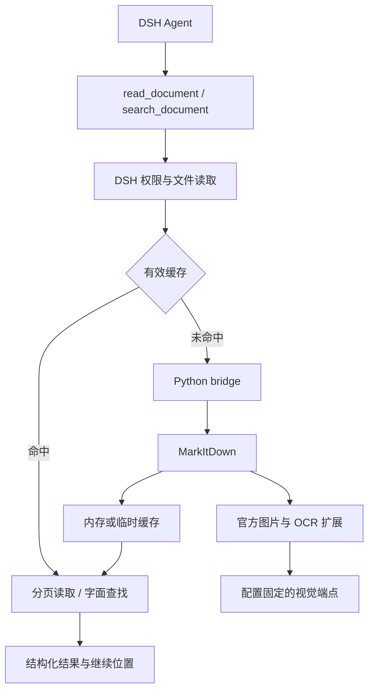

> 版本说明：本文保留最初设计基线。0.3.0 的 Word 渐进执行、分层持久缓存、图片独立定位和续查语义，以 [upgrade-0.3.0.md](upgrade-0.3.0.md) 及当前源码为准；其他格式保留原有路径。

# dsh-document-reader：源码调研与 V1 技术设计

> 本文保留最初设计作为历史依据。0.2.0 已增加原生配置页面与 DSH 统一视觉调用，详见 [升级说明](upgrade-0.2.0.md)。当前 DSH 基线为 0.1.7-rc.2，Python 依赖为 PyPI 发布包 markitdown 0.1.7 与 markitdown-ocr 0.1.0，使用 stable_compat.py 补足旧版图片接口。下文的独立视觉端点设计与旧源码版本表不能作为当前配置基线。当前安装方法以 README.md 为准，验证结果见 docs/validation.md。

调研日期：2026-09-18。修订日期：2026-09-18。状态：已合并需求复核及简化搜索设计，尚未实施插件编码。

本次修订以讨论最后确认的简化接口为准：V1 增加关键词查找、原文位置映射、转换结果版本和可复制的后续参数；早期多参数搜索草案不作为实施要求。原源码基线保持不变，本轮仅修改设计，没有重新验证依赖或运行集成测试。

本设计依据本次实际拉取的 DSH、Microsoft MarkItDown 源码及用户提供的需求文档。文中的接口事实、设计决策和待验证事项分别说明；源码可用不等于发行包已经包含相同实现，也不等于已经通过 Windows 或真实视觉模型验收。

## 1. 推荐结论

可以开发为一个独立 DSH 原生 Tool 插件。V1 提供 `read_document` 与 `search_document` 两个原生 Tool，共享同一转换、权限与缓存实现，采用 DSH TypeScript 适配层、按需启动的 Python 子进程、MarkItDown，以及插件配置固定的 OpenAI-compatible 视觉端点。无需增加 Agent、MCP Server、数据库或独立 Web UI。

必须把以下事实纳入设计：

1. **采用当前 `defineTool` 的结构化输出协议。** `execute` 返回 canonical JSON，由 `output.schema` 校验，再由 `output.render` 生成模型可见内容；不能套用旧版“execute 直接返回 content blocks”的写法。[工具接口][D-tool]
2. **分页只限制返回给模型的内容。** MarkItDown 当前返回完整 `result.markdown`；后续翻页复用转换结果，不代表第一次只解析请求的页，也不能承诺 Python 转换阶段恒定内存。[结果类型][M-result]
3. **读取权限交给 `ctx.fs`。** 当前默认 DSH 文件沙箱主要约束写入，工作区外的绝对路径读取并非默认禁止。不得把 `cwd` 误当作读取白名单。[本地 FS][D-fslocal]、[FS 沙箱][D-fssandbox]
4. **内嵌图片与原生矢量图形不是同一种支持。** PPT 图片、扫描图像可经视觉模型处理；PPT 原生形状及连接线、PDF 矢量图的完整空间关系，不在当前转换器保证范围内。[PPT 转换器][M-pptx]、[PDF OCR 转换器][M-pdfocr]
5. **固定源码版本，不能只写未限定版本的 pip 安装。** 本次主分支中的 Office OCR 重构依赖 MarkItDown `0.1.8b3` 的接口，而查询到的 PyPI 核心预发布最高为 `0.1.8b2`。[OCR 依赖][M-ocrproject]、[PyPI 核心版本][P-core]
6. **OCR 失败必须可见。** 上游部分路径会吞掉视觉异常并继续输出正文；插件不能仅凭转换函数返回成功就宣称文档读取完整。[OCR 服务][M-service]

## 2. 源码基线与验证范围

| 项目 | 本次实际读取的基线 | 说明 |
|---|---|---|
| DeepSeek Harness | `0.1.6-alpha.2` | 根项目、CLI、tools、fs、subprocess 包版本一致 |
| DSH commit | `ddefc45fbc7f8e46dd73185e68295696d1297887` | `master` 快照；提交时间 2026-09-17 21:19:19 +08:00 |
| Cordis | `@deepseek-ai/cordis` `4.0.2` | 来自本次 DSH 的 `vendor/cordis/package.json` |
| Schemastery | `@deepseek-ai/schemastery` `3.18.2` | 来自本次 DSH 的 `vendor/schemastery/package.json` |
| DSH Node 要求 | `^22.19.0 || >=24.0.0` | 使用实际 package.json 的 engines |
| Microsoft MarkItDown commit | `945314a45ddbe02935f2fd287b797dc0ba4a01e4` | `main` 快照；提交时间 2026-09-16 10:23:08 -07:00，即北京时间 9 月 17 日 01:23:08 |
| MarkItDown 源码版本 | `0.1.8b3` | `packages/markitdown/src/markitdown/__about__.py` |
| markitdown-ocr 源码版本 | `0.1.1b2` | `packages/markitdown-ocr/src/markitdown_ocr/__about__.py` |
| Python 最低版本 | 3.10 | 核心库与 OCR 包共同要求；V1 优先以 Python 3.12 做 Windows 验证 |

基线出处：[DSH commit][D-commit]、[DSH package.json][D-package]、[MarkItDown commit][M-commit]、[核心包元数据][M-project]。

PyPI 查询结果需要单独记录：核心稳定版为 `0.1.7`，已发布预发布版包括 `0.1.8b1`、`0.1.8b2`；OCR 稳定版为 `0.1.0`，预发布版包括 `0.1.1b1`、`0.1.1b2`。**本次源码中的 OCR 版本号仍是 b2，但其代码已包含 9 月 16 日合并的 Office 重构；只锁 `markitdown-ocr==0.1.1b2` 不能证明拿到了该 commit 的代码。** [PyPI 核心][P-core]、[PyPI OCR][P-ocr]、[重构提交][M-commit]

本次已完成源码阅读、关键调用路径核对及发行版本查询；未安装或启动用户本机 DSH，未运行该插件，未调用真实视觉端点，未完成 Windows、真实 Office 文档及扫描 PDF 的集成测试。用户本机版本仍未知，实施时需与上述基线核对。

## 3. DSH 源码调研结果

### 3.1 项目指令与实现参照

已读取根 `AGENTS.md`、`packages/AGENTS.md`、架构说明、生命周期与防御性编程说明，并以原生 `tool-fs` 和官方 Tool authoring reference 为接口参照。与本插件直接有关的约束是：函数插件使用 named exports；注册随 fiber 撤销；外部资源必须有 disposer；处理 `exec.signal`；依赖当前公开接口；可调参数进入配置；模型可见内容不暴露内部实现细节。[根指令][D-agents]、[包指令][D-pkgagents]

V1 不修改 DSH 内核，也不为了实现这个 Tool 增加新的公共 Service Definition/Provider 分层。

### 3.2 关键接口文件

| 需要确认的事项 | 实际文件/接口 | 对本插件的决定 |
|---|---|---|
| 插件结构 | `packages/AGENTS.md`；`name / inject / Config / apply` | 函数插件，不混用 default export |
| Tool 注册 | `packages/core/tools/src/index.ts`；`ctx.tools.register` | 使用 `defineTool`；register 本身已绑定 effect |
| Tool Schema | `packages/core/tools/src/schema.ts` | 使用 DSH 字段式参数 DSL，执行层补充正整数/范围验证 |
| 返回值 | `docs/cookbook/adding-a-tool.md` | `execute → canonical JSON → output.render` |
| 原生读取 | `packages/fs/tool-fs/src/read.ts` | offset 从 1 开始，limit 默认及上限为配置值 |
| 输出限制 | `packages/fs/tool-fs/src/read-render.ts` | 参考 2,000 行、50 KiB；避免静默丢弃超长行 |
| 路径和版本 | `packages/fs/fs/src/index.ts`、`types.ts` | `resolve / stat / readBytes / readByteRange`；版本作为不透明 token |
| 本地路径 | `packages/fs/fs-local/src/index.ts`、`fsio.ts` | 相对路径使用 session cwd；交给 provider 处理 realpath |
| 文件沙箱 | `packages/fs/fs-sandbox/src/index.ts` | 保留当前读取权限语义，不把写权限模式解释成读隔离 |
| 当前会话 | `exec.agent?.session` | 可获得 `id`、`header.cwd` |
| 会话退出 | `packages/core/session/src/index.ts`；`session/disposed` | 用于清理会话缓存；不把 turn/end 当成 session end |
| 子进程 | `packages/subprocess/subprocess/src/index.ts`、`types.ts` | `resolveExecutable / spawn / terminate / waitForExit` |
| 超额确认 | `packages/interaction/user-approval/src/index.ts` | `ctx.approval.request`；仅 allowed-once 继续 |
| 模型接口 | `packages/llm/llm/src/index.ts`、`types.ts` | V2 可显式 provider/model；V1 无 llm 注入 |
| 配置与分发 | `docs/user/develop/basic/config.md`、`publish.md` | Schemastery 校验；bundle patch；profile 安装 |

对应源码：[工具定义][D-toolsrc]、[参数 DSL][D-schema]、[FS 服务][D-fs]、[Session 事件][D-session]、[子进程服务][D-subprocess]、[审批服务][D-approval]、[LLM 服务][D-llm]。

### 3.3 原生 read 的真实行为

`offset` 默认 1，`limit` 默认 2,000，默认最大也是 2,000；两者必须为正整数，超出 limit 上限报错。原生 read 默认每行最多 2,000 字符，选中行最多 50 KiB；原文件达到 10 MiB 或大小未知时流式读取。返回的是 `{ path, offset, lines: [{number,text}], totalLines }`，然后渲染为带行号、结束/继续提示的文本。[读取实现][D-read]、[渲染实现][D-render]

本插件沿用起始行、行数限制、明确 next offset 的语义；不直接深层导入 `tool-fs/src/read-render.ts`。这些是内部实现，不作为独立插件的稳定依赖。

有一项有意区别：文档中的长表格行不能静默截断后假装读完。本设计优先按完整行返回；超长单行使用工具生成的片段游标继续读取，不要求 Agent 计算列偏移，也不改写 Markdown 的行结构。具体规则见第 6 章。

### 3.4 注册、生命周期与会话

必需服务为 `tools`、`fs`、`subprocess`；`systemPrompt` 可以通过条件注入注册一小段作用域相关的使用提示。`approval` 仅在超额时使用 `ctx.get('approval')` 检查；未配置时正常小文档仍可读，超额操作失败关闭。V1 不依赖 `llm`。

`ctx.tools.register()` 已经在内部创建可撤销注册，不需要再套一层重复的 register disposer。计时器、子进程集合和临时目录通过一个插件生命周期 effect 管理。停止时先禁止新任务，再取消并等待转换任务退出，关闭缓存读写句柄，最后删除自己的临时目录。[注册实现][D-toolsrc]、[生命周期][D-life]

当前源码确实提供 `session/disposed`。该事件表示 Session 离开运行时 store，不等价于关闭浏览器标签或一轮对话结束。因此采用 **TTL + session/disposed + plugin dispose**，TTL 始终作为兜底。事件是同步 emit，回调启动的异步清理需被插件跟踪，不能假设事件发出方会等待其完成。[Session 事件][D-session]

### 3.5 配置加载与覆盖

使用 `@deepseek-ai/schemastery` 导出的 `Config`，在 `apply(ctx, config)` 接收校验后的结果。当前 profile 的层叠顺序是：bundle 列表顺序、profile patch、home patch、命令行 `--patch` 顺序；后层按 id 覆盖。**覆盖插件行时，整个 `config` 被替换，不做深度合并。** 未提供的字段再由本插件的 schema 默认值补齐，不会保留被替换配置中的旧值。[配置定义][D-config]、[分发及覆盖规则][D-publish]

当前 DSH 支持 `!!js process.env.X` 表达式，不能假设普通 YAML 字符串 `${VISION_BASE_URL}` 会自动展开。API Key 使用环境变量名配置，不把明文 Key 放进 config 或 patch。[Cordis 配置机制][D-primer]

### 3.6 Windows Python 子进程

优先使用 DSH 的 `ctx.subprocess`，而非自行实现 `child_process.exec`、命令拼接或 taskkill。该服务使用 argv 数组；本地 provider 提供 Windows executable 查找、隐藏普通子进程窗口以及 Job 生命周期管理。子进程管理不等价于文件或网络沙箱，不能据此声称 Python 已获得内核级权限隔离。[子进程接口][D-subprocess-types]、[本地 provider][D-subprocesslocal]

Python 发现顺序：用户配置的绝对 `python.executable`；安装脚本创建的专用 venv；通过 `resolveExecutable` 查找并实际探测 `python`、`python3` 或 Windows 的 `py -3`。`py` 只用于发现真实 `sys.executable`，转换阶段使用解析后的解释器路径。验证版本、依赖和桥接协议，不以“命令存在”代表可用。

启动采用 `python -I -X utf8 -u <bridge-path>`，参数逐项传递；路径、文档正文和 Key 不放进拼接命令。`-I` 避免项目目录及环境注入影响 Python 模块解析；专用 venv 的 site-packages 仍可用。仅显式传入所选视觉 Key，其他凭证沿用 DSH 的环境清理机制。

V1 的受支持部署为 DSH 与 Python 在同一台本地主机，优先 Windows 11。不把 SSH/远程 subprocess provider 与本地插件目录混用；远程执行环境留到 V2。

### 3.7 ctx.llm 的 V2 接口事实

当前 `GenerateOptions` 包含显式必填 `provider`、`model`，以及可选 `sessionId`、`signal`；服务提供 `resolveModelInfo(provider, model, signal)`、`prepareCall`、`stream`。模型信息中的 `inputModalities` 可以包含 `image`；字段缺失表示未知，不代表支持。图像消息使用 DSH 的图像附件引用体系，不能直接将 Python 的任意 base64 对象当成 DSH 消息。[LLM 服务][D-llm]、[消息与模型类型][D-llmtypes]

因此 V2 可以统一凭证、模型能力与调用追踪，但还需要图像附件与流式结果适配。当前没有理由为 V1 重写 MarkItDown 的视觉客户端。

## 4. MarkItDown API 与能力调研

### 4.1 应使用的 API

| 能力 | 本次源码确认的 API | V1 用法 |
|---|---|---|
| 转换本地路径 | `MarkItDown.convert_local(path, stream_info=...)` | 已确认存在，但不让 Python 直接重新打开 Agent 提供的路径 |
| 转换已授权字节 | `convert_stream(stream, stream_info=StreamInfo(...))` | 主路线；输入为可 seek 的二进制流 |
| 转换结果 | `result.markdown` | 使用正式字段；`text_content` 已是 soft-deprecated alias |
| 原生图片说明 | `llm_client / llm_model / llm_prompt` | 固定端点，不读取主会话模型 |
| OCR 扩展 | `markitdown_ocr.register_converters(...)` | 显式注册官方 OCR，不自动加载其他已安装插件 |
| OCR 服务 | `LLMVisionOCRService`、`OCRResult` | 复用图像识别；记录失败和实际调用事实 |
| 异常 | `UnsupportedFormatException / FileConversionException / MissingDependencyException` | 在 bridge 映射成脱敏中文错误 |

出处：[核心转换 API][M-api]、[结果类型][M-result]、[OCR 注册][M-plugin]、[OCR 服务][M-service]。

MarkItDown 的自动 plugin discovery 会加载 Python 环境中注册的第三方插件。V1 明确 `enable_builtins=False, enable_plugins=False`，再通过公开的 `register_converter` 注册所需官方 PDF/DOCX/PPTX/XLSX/XLS/CSV/Image converters；需要图像增强时，显式调用官方 OCR 包的 `register_converters`。不注册 ZIP、URL、音视频等额外 converters，不自动加载第三方插件，也不使用通用 `convert(uri)` 入口。[核心 API][M-api]

### 4.2 V1 格式能力矩阵

| 格式 | 正文/结构 | 图片与 OCR | 明确限制 |
|---|---|---|---|
| PDF | 文本及转换器可提取的结构 | OCR 包提取图像；包含整页渲染回退路径 | 复杂布局、矢量图空间关系、混合扫描页不能保证完整；需专门验收 |
| DOCX | 原生段落、表格及核心预处理 | OCR 经 Mammoth 图片 hook 插入 | 不保证 Word 页面布局、浮动对象及全部复杂对象 |
| PPTX | 文本、表格、支持的图表数据、备注、分组遍历 | 图片、含图 placeholder、分组内图片 | 不保证原生形状/连线拓扑、SmartArt 或整页视觉布局 |
| XLSX | 按 sheet 输出表格 | 图片位于该 sheet 的表格后 | 不保证单元格级图片位置；不执行公式重算；不承诺图表完整语义 |
| XLS | 旧版 Excel 表格 | 当前官方 OCR 不覆盖 XLS 图片 | 必须明确图片未分析，不能声称与 XLSX 等价 |
| PNG/JPEG | 原生图片转换器 | 固定端点进行描述/OCR | 作为低成本附加格式；视觉关闭时只能给出有限元数据或明确无可读内容 |
| CSV | 原生表格转换 | 无 OCR 需求 | 受同样的行与响应大小限制 |

出处：[PPTX][M-pptx]、[DOCX][M-docx]、[XLSX/XLS][M-xlsx]、[PDF OCR][M-pdfocr]、[图片转换器][M-image]。

V1 不启用 HTML、EPUB、ZIP、音频、视频、YouTube 或任意网络 URI。不是因为 MarkItDown 不支持，而是它们超出本轮必要范围；先避免引入外部资源获取、递归容器和新的依赖行为。

### 4.3 Vision 与 OCR 的具体控制

两个开关表示**本次图像分析的目的**，共用一个配置固定的端点与模型；不是两次独立模型调用。

| vision.enabled | ocr.enabled | 行为 |
|---|---|---|
| false | false | 原生文本转换，不创建视觉客户端 |
| true | false | 图像语义描述；保留解释图形所必要的标签，不要求完整逐字转录 |
| false | true | 尽量逐字提取可见文字/表格，不增加无依据说明 |
| true | true | 同一次请求输出文字提取与图形关系说明，区分识别到的内容和推断 |

Office/PDF 的后三种模式均可借用官方 OCR 包提供的图片提取与插入流程，再通过 `llm_prompt` 指定目的。这里复用的是官方图像处理机制，不要求 OCR 包名与用户侧开关一一对应。

为避免 PPTX 原生 caption 优先返回后跳过 OCR hook，Office/PDF 路线不向核心 `MarkItDown` 实例额外注入另一套 caption client；只向显式注册的官方 OCR converters 提供固定 client/model/prompt。独立 PNG/JPEG 使用核心 image converter 的 caption 接口。这使同一图片不会被本插件主动“先说明一次、再 OCR 一次”。[PPT 图片分支][M-pptx]、[OCR 注册][M-plugin]

bridge 在 OpenAI-compatible client 外增加很薄的调用记录与限额包装：记录尝试/成功/失败次数、检查单文档调用上限、清理错误，不处理图片提取，不选择模型，不增加模型路由。重复图片是否复用首先交由上游转换器；不承诺跨文件、跨会话图片去重。

`visionUsed` 表示生成这一份转换结果期间，确实有视觉调用成功返回了非空内容；OCR 同理。它不是图像覆盖率或正确率。缓存命中时它们描述该结果的生成事实，而非本次翻页又发起了模型请求。开关开启但请求全部失败时不能置为成功，必须有 `partial` 和 warning。

官方 OCR converters 会使用 `[Image OCR]` 标记，即使自定义 prompt 请求的是图形说明。模型输出需明确说明：启用图像语义分析时，这些图像段落可能包含模型生成的解释，不等于文档中的逐字原文。无需为了更换标记复制上游转换器。

### 4.4 已发现的扫描 PDF 风险

在本次 `_pdf_converter_with_ocr.py` 中，每页先加入 `## Page N`。文档级整页 OCR 回退却以最终 Markdown 是否为空作为条件。由此可推导：**若页没有提取到正文且图片提取也失败，页标题仍可能使回退条件不成立。** 这是源码分支分析，尚未以真实异常扫描件复现，不能扩大表述为“扫描 PDF 全部不可用”。[PDF OCR 源码][M-pdfocr]

同一文件还包含宽泛异常后退回文本解析的路径，且图像 OCR 返回错误不一定抛出到最上层。因此 V1 必须：

- 识别只有页标题、没有可读内容的结果，返回 `DOCUMENT_NO_READABLE_CONTENT` 或明确 partial；不得当成成功读完。
- 对能观测到的 OCR 调用失败逐项计数；对未提取到图像的情况不能凭调用次数声称全覆盖。
- 编码第一阶段用纯扫描、混合文本/扫描、无可提取图片对象、损坏 PDF 样例复现边界。
- 如失败妨碍约定的扫描 PDF 验收，优先锁定官方修复 commit；必要时仅接受单独记录、带回归用例的上游兼容补丁。不得悄悄复制整个 PDF converter，也不得把完整扫描支持自动降级为“尽力而为”后宣称通过验收。

这项风险是正式发布前的验收门槛。当前设计不把它伪装成已经解决的问题。

### 4.5 原文映射与内容来源适配

MarkItDown 最终 Markdown 不是统一结构化位置 API。V1 必须先验证 PDF（OCR 开/关）、PPTX 和 Office 文本块能否保留稳定映射。不得在任意正文中匹配 `## Page N` 就认定页界；文档自身可能包含相同文本。优先沿官方 converter 的页/slide/对象遍历获取边界，必要时引入范围明确、锁定 commit、有回归样例的兼容适配，不复制整套解析器。

bridge 输出每个文本区间的源定位、块 ID、来源类别，以及已知提取缺口。最终 LF 规范化完成后校准到 canonical Markdown 的 UTF-8 字节区间和行号；NFC/大小写搜索产生的影子区间须能映射回这份正文。映射不可靠的范围必须显式标记，不能推测页码，也不能把不同页合并用于 ALL。PDF/PPTX 准确定位是实施第一阶段门槛，无法实现时须重新约定范围，不能静默降级。

来源类别至少为 native、ocr_transcript、generated_description、mixed_or_unknown。启用 OCR+vision 时同一次模型响应中的转录与说明必须有可校验边界；若解析失败或上游无法保留边界，则整体记 mixed_or_unknown，不因 prompt 要求区分就假设已经可靠分离。即使标为 OCR 转录，也不代表识别一定正确。使用说明中的“官方 OCR 标记”不能代替真实来源元数据。

### 4.6 内容覆盖契约与 PDF 对照验收

| 内容 | V1 覆盖要求及限制 |
|---|---|
| PDF 正文、表格、表单 | 按锁定转换器能力验收；OCR 开启与关闭作同文档对照 |
| PDF 空白页、封面、混合扫描 | 保留物理页序；不能因无文本就删除页号或使后续偏移 |
| DOCX 页眉页脚、脚注尾注、批注、修订 | 尚未逐项验证，均不得承诺完整覆盖；实施时建立包含/排除矩阵与样例，输出已知缺口 |
| PPTX 备注、隐藏幻灯片 | 备注来源需标明；隐藏幻灯片的包含行为须验证并固定，不能因隐藏就静默跳过 |
| Excel 隐藏工作表、行列、批注、公式 | 包含行为逐项验证；公式不重算；不得把 Markdown 表格行号当作源单元格坐标 |
| 图像说明及复杂对象 | 说明与原文区分；原生矢量拓扑仍不保证 |

锁定版本的普通 PDF 与 OCR PDF 使用不同流程，OCR 路线不能假定保留普通路线的表格/表单质量。[普通 PDF 转换器][M-pdf]、[PDF OCR 转换器][M-pdfocr]。同一文件开关 OCR 比较正文、表格、页序及丢失对象；若明显回退，先评估有界适配或上游修复，禁止简单拼接两次全文造成重复、错序与错页。以上仍是待执行验收，不是已经验证支持的声明。

## 5. 最终架构



TypeScript 负责两个 Tool、DSH 权限路径、缓存、分页、查找、审批、生命周期；Python 负责协议、调用上游转换 API、固定视觉客户端，以及位置与内容来源元数据。一个进程完成一个转换任务；翻页不启动 Python。V1 不常驻 Python daemon，不做进程池、后台任务或持久队列。

读源文件的流程是 `ctx.fs.resolve → stat → 有界字节读取 → Python 可 seek 流`。Python 不重新打开 Agent 提供的原始路径，避免“TypeScript 检查过，Python 再绕开 provider 读取一次”。

## 6. Tool Schema 与输出

### 6.1 参数设计：意图参数与续读参数分开

下列 TypeScript 类型是接口设计示意。实现时使用 DSH 字段 DSL、执行层交叉校验和封闭的输出 schema，不假设 DSL 能完整表达互斥分支。

```ts
// 正常读取
read_document({
  file_path: string,
  offset?: number,                 // 转换文本的 1-based 行号，默认 1
  limit?: number,                  // 默认/最大 read.maxLines
  expected_revision?: string       // 从工具结果复制，禁止自行编造
})

// 正常搜索：只有两个必填参数，一个可选意图参数
search_document({
  file_path: string,
  keywords: string[],
  require_all?: boolean            // 默认 false：任一关键词命中
})

// 后续调用：直接复制工具返回的 next_read_args / next_search_args
read_document({ file_path: string, cursor: string })
search_document({ file_path: string, cursor: string })
```

每个 Tool 仍只有一个注册入口，`cursor` 是额外的可选字段：有 cursor 时，仅接受 `file_path + cursor`；无 cursor 时按正常调用分支校验。不得混传 offset、limit、keywords 等字段；返回具体纠正提示。游标是工具生成的会话内不透明 token，不是新增的搜索决策参数。不得提供第三个 continuation Tool。

`file_path` 交给 ctx.fs 解析。空路径、空关键词、纯空白关键词、类型错误、未知参数均拒绝；不得将未知参数透传 Python。关键词非空时保留原始空白，不静默 trim 改变查询含义。V1 不接受模型、provider、端点、缓存路径、审批覆盖参数。

### 6.2 offset 在 Word 及其他格式中的作用

所有格式的 offset 都指向**转换后 Markdown 的行号**，不是 Word 排版行号，也不是 PDF 页码。Word 转换后有 3,000 行时，`offset: 501, limit: 100` 请求从转换文本第 501 行开始最多 100 行。

offset 用于连续阅读，以及搜索后读取命中附近的上下文。Word 无可靠分页引擎，因此返回标题路径、文本块及转换行号；不由行号推算 Word 页码。后续读取应直接复制 `read_args` 或 `next_read_args`，绑定 `expected_revision` 或游标，避免缓存重建后拼接不同文本。

### 6.3 V1 固定匹配规则

| 项目 | 固定规则 |
|---|---|
| 字面包含 | 默认包含匹配；一个 keyword 是完整字符串，不拆词 |
| 大小写 | 默认忽略；采用固定、与系统 locale 无关的 Unicode 简单大小写匹配规则，并固定实现版本 |
| 多关键词 | require_all=false 为 ANY；true 为同一范围单元内 ALL，顺序不限 |
| 特殊字符 | `C++`、`a.b`、`node*`、`A AND B` 均按字面，不解析表达式 |
| 文本规范化 | 最终读取文本统一 LF；搜索影子文本采用 NFC，保留到原始读取文本的区间映射 |
| 空白与换行 | 保留区别，不删除所有空白，不跨段、页、单元格拼接短语 |
| 搜索来源 | 原生文字与明确隔离的 OCR 转录；排除模型说明及无法分离的混合说明 |
| 排序与聚合 | 文档原有顺序；每个满足条件的范围单元返回一条结果 |

包含匹配 `node` 会命中 `node`、`nodes`、`node_count`、`node-1`。查询 `high availability` 是完整短语；`["high", "availability"]` 才是两个关键词。`故障\n切换` 不隐式命中 `故障切换`。匹配不得跨不同内容来源的边界合成一个短语。

全词、区分大小写选项、排除词、正则、通配符、嵌套布尔、邻近表达式、模糊匹配和语义检索均不进入 V1。原“正则放 V1.1”改为根据实际失败案例决定，不承诺固定版本。用户提出这些要求时说明当前能力边界，不静默模拟成普通包含查找。

### 6.4 条件范围与可靠原文位置

| 格式 | 固定条件范围 / 返回单位 | 可返回的原文位置 |
|---|---|---|
| PDF | 一个物理页 | 1-based 物理页序号；不当作印刷页码 |
| PPTX | 一张幻灯片，包含已提取备注 | 1-based 幻灯片序号；片段注明正文或备注；隐藏状态可观测则标明 |
| DOCX | 一个文本块 | 标题路径、块 ID、转换行范围；不承诺排版页码 |
| XLSX / XLS | 一个工作表 | 工作表名、转换行范围；只有保留源坐标时才返回单元格 |
| CSV | 一条记录 | 记录序号、转换行范围；不把多行字段当成多个原始记录 |
| PNG / JPEG | 一张图片 | 图片及识别片段，无页码或未经获取的文字框坐标 |

Word block 为一个转换段落、标题或一条表格记录；不按固定行数机械切块。位置和 block ID 只在同一转换 revision 内有效。每个关键词的匹配在连续且允许搜索的文本片段内完成；ANY/ALL 再在上述范围汇总，因此 ALL 可在同页不同段落分别出现。它不证明词语之间存在语义关系。

不向 Agent 暴露 within 参数。用户要求“Word 同页包含两个词”时必须说明无法可靠判断；不得静默改成同块。一个范围仅部分内容被提取时，未满足 ALL 不代表原范围不满足条件。

### 6.5 读取输出与超长行

```ts
{
  file: string, format: string, document_revision: string,
  offset: number, returnedLines: number, totalLines: number,
  nextOffset: number | null, eof: boolean,
  content: string,
  locations: SourceLocation[],
  line_fragment: boolean,
  next_read_args: ReadArgs | null,
  visionUsed: boolean, ocrUsed: boolean,
  partial: boolean, warnings: string[],
  extraction_coverage: "no_known_gaps" | "known_gaps" | "unknown"
}
```

正常按完整行返回，nextOffset 为实际下一行。单行无法放入预算时返回非空片段，`line_fragment=true`，标明当前行与片段范围，并提供仅含 file_path/cursor 的 next_read_args；nextOffset=null 防止误认为下一行已经开始。returnedLines 计完整返回的行数，片段可能对应 0 个完整行；eof=false，直至最后片段完成。片段按 Unicode 码点边界切分，游标内保存精确位置，不重复或遗漏字符。同一机制允许搜索结果定位超长行内的命中位置。

普通分页的 next_read_args 包含 offset、limit、expected_revision；超长行续读含 cursor。除首次自由浏览外，模型应复制返回参数，不自己计算位置。预算小到无法容纳包装和至少一个码点时返回配置错误，不能无限返回空片段。

默认 50 KiB 同时限制 canonical JSON 与最终模型渲染文本；行号、位置、warnings 和继续参数都计入预算。保留 LF 及原有行结构。非空文档 offset 超过总行数时报错；只有页标题的扫描内容不能当作正常完整正文。

`eof` 只表示到达当前转换文本末尾；`partial` 表示已知缺失；`no_known_gaps` 也仅表示未观测到缺口，不证明所有原始对象均已完整提取。工具不得以这些字段宣称理解了整份文档。

### 6.6 搜索输出、预算和续查

```ts
{
  file: string, format: string, document_revision: string,
  effective_scope: "page" | "slide" | "block" | "sheet" | "record" | "image",
  keywords: string[], require_all: boolean,
  results: [{
    location: SourceLocation,
    matched_keywords: string[],
    snippets: [{ keyword: string, source: "native" | "ocr_transcript",
                start_line: number, end_line: number, text: string,
                read_args: ReadArgs }],
    snippets_truncated: boolean
  }],
  scan_complete: boolean,
  has_more: boolean | null,
  next_search_args: SearchArgs | null,
  partial: boolean,
  extraction_coverage: "no_known_gaps" | "known_gaps" | "unknown",
  excluded_content: string[],
  warnings: string[]
}
```

这是字段契约草案，SourceLocation 按上一节格式定义；不得填造不存在的位置。snippets 优先覆盖不同关键词，片段不足以容纳所有命中词时标明 snippets_truncated；matched_keywords 仍必须来自完整条件判断。只给代表片段，不承诺展示范围内每次出现。

默认最多 20 个范围单元，并受 50 KiB 总输出上限约束。搜索可有界扫描缓存并随数量、字节或时间预算暂停。`scan_complete=true` 仅在已扫描全部可搜索文本时成立；has_more=true 表示已确认还有命中，false 表示已确认没有，null 表示尚未知。未完成扫描时提供 next_search_args，即使本次没有命中；绝不能把未知写成 false。V1 不返回未经完整扫描的总命中数。

游标保存查询、revision、有效范围、来源规则、扫描位置和未完成范围的匹配状态，继续时既不重复也不漏掉结果。若单个范围太大，允许在该范围内暂停，但必须完成该范围的条件判断后才发布结果，尤其不能提前认定 ALL 不成立。过期或不属于当前会话的 cursor 明确报错，不能自动重建后继续旧位置。

“零结果”的固定表述为“在已扫描的已提取内容中未找到”；返回扫描是否完成、提取缺口和排除来源。生成的图像说明可能含原图没有的关键词，故不进入 V1 搜索；用户仍可通过 read_document 查看并识别其生成说明属性。未知/混合来源不能伪装成逐字 OCR。

首次查询仍可能需要完整转换和 OCR；缓存命中查询不转换、不调用模型。验收分别记录首次转换耗时、缓存查找耗时及返回字节量，不承诺任意大扫描件首次秒级返回。

### 6.7 Agent 引导与 UI

Tool description 简短列出固定规则、Word 页码限制和三个典型调用：

```json
{"file_path":"方案.docx","keywords":["故障切换"]}
{"file_path":"方案.docx","keywords":["主备","集群"]}
{"file_path":"方案.pdf","keywords":["主备","切换"],"require_all":true}
```

提示 Agent：先查找相关位置，再直接复制命中片段的 read_args；连续读取与续查复制 next_*_args；如遇版本失效，重新查找；有缺失、未知覆盖或来源排除时不要断言原文不存在关键词。工具说明无需塞入缓存和协议实现细节，也不额外增加 Skill。

执行层返回可操作的纠正提示，例如“cursor 续查只允许 file_path 与 cursor，请复制 next_search_args”。V1 使用 DSH 通用 Tool 卡片，展示阅读范围、可靠原文位置及 warnings；不能把转换行号宣称为 Office 原文可跳转行。专用 Web 卡片仍不属于 V1。[工具展示约定][D-tool]

## 7. 配置 Schema

以下是推荐的 V1 配置字段及初始默认值。这些数值是待真实文档验证的工程起点，不是性能测量结论。

```yaml
# 已安装 bundle 后，在 profile 的 cordis.patch.yml 中覆盖该行。
- id: document-reader
  config:
    python:
      # 可省略，按专用 venv / PATH 进行探测。
      # executable: 'C:\Users\Alex\AppData\Local\dsh-document-reader\venv\Scripts\python.exe'
      startupTimeoutMs: 10000
      terminateGraceMs: 3000

    conversion:
      timeoutMs: 300000
      maxConcurrent: 1
      maxSourceMiB: 512
      maxResultMiB: 512
      sourceMemoryMiB: 8

    read:
      maxLines: 2000
      maxBytes: 51200

    search:
      maxResults: 20
      maxBytes: 51200
      maxKeywords: 16
      maxKeywordChars: 256
      snippetChars: 240
      scanTimeoutMs: 5000

    cache:
      memoryEntryMiB: 1
      memoryTotalMiB: 16
      maxTotalMiB: 256
      ttlMinutes: 30
      partialTtlMinutes: 5
      sweepIntervalSeconds: 60

    vision:
      enabled: false
      baseURL: !!js process.env.VISION_BASE_URL
      apiKeyEnv: VISION_API_KEY
      model: ''
      requestTimeoutMs: 60000
      maxRetries: 1
      maxCallsPerDocument: 100
      # prompt: '可选，覆盖默认的图像分析提示'

    ocr:
      enabled: false
```

YAML 中 Windows 单引号路径使用普通反斜杠；上面的路径只作位置示例，安装脚本会输出用户机器上的实际路径，不要求照抄用户名。

类型与交叉验证规则：

| 配置组 | 校验与语义 |
|---|---|
| python | executable 若指定必须为可执行文件路径，不能含整条 shell 命令；时间值为正整数 |
| conversion | 大小、并发、超时为正值；maxSource/maxResult 是硬上限，普通单次审批不能绕过 |
| read | 正整数；maxBytes 必须容纳必要包装；limit 不得超出 maxLines |
| search | 均为正整数；字符长度按 Unicode 码点计；数量与预算由配置控制，Agent 不传入；超时可续查，不伪报零结果 |
| cache | `memoryEntry ≤ memoryTotal ≤ maxTotal`；大小非零；普通 TTL 为闲置时长；partial TTL 为创建起的绝对时长，且不大于普通 TTL |
| vision / ocr | 任一启用则必须有明确 baseURL、model 及可解析 Key；禁用时不要求视觉凭证 |
| vision.maxCallsPerDocument | 达到上限后不再出网；返回 partial/warning，不静默跳过剩余内容 |
| vision.prompt | 可选，由用户配置；Tool 参数无权覆盖；prompt 变化需要重新转换 |

**源文件 URL、自动插件发现是 V1 固定禁用项；UNC/映射共享盘的产品范围见第 10 章待确认项。不暴露尚未实现的 allowRemoteUrl 开关。** 不另设 workspace allowedRoots 配置，避免与 DSH 的文件权限产生两个来源。

启用示例：将 `vision.enabled`、`ocr.enabled` 改为 true，填写实际支持图像输入的模型 id，并设置 `VISION_BASE_URL`、`VISION_API_KEY`。不把需求示例里的模型名当成已验证可用的默认值。

## 8. 缓存与生命周期

### 8.1 缓存身份

逻辑键为：`plugin instance / session identity / ctx.fs targetKey / FsVersion / conversion settings fingerprint`。使用 provider 返回的版本 token，不解析其中的 mtime/inode；fingerprint 包含格式、视觉与 OCR 开关、模型/端点/提示配置、bridge 协议及依赖源码基线，不包含 API Key 明文。[FS 类型][D-fstypes]

不做跨 Session 共享。普通 Agent 调用使用 `exec.agent.session`；无 Agent 的程序化调用只保留调用内缓存，结束即释放，避免匿名全局缓存泄漏。此限制不影响常规会话内连续翻页。

每次读取、搜索和游标续查仍走 DSH Tool policy，再 resolve/stat；缓存命中也不能绕过 provider 的读取权限。本次 FS 没有独立 `checkRead` 方法，命中路径需以有界 `readByteRange` 做实际读访问校验。部署中按工具名只拦截 `read` 的自定义策略，必须把 `read_document` 和 `search_document` 纳入同一策略；新工具不会自动继承旧工具名称的规则。自定义 provider 若有内容级/逐范围权限，应单独验收后再声明兼容。

第一次转换期间，读取前后检查同一个 target 的版本；版本变化则放弃结果并提示重试，不发布混合版本缓存。依赖 OS/provider 的版本保证，不声称 stat 前后比较可以防御恶意修改者的所有竞态。

### 8.1.1 源版本与转换版本

FsVersion 标识源文件版本；`document_revision` 标识一次成功发布的转换快照，两者不能混用。每次重新转换分配新 revision，即使源文件没变、最终文本偶然相同，也不复用旧 revision。配置、提示或位置适配版本变化同样产生新 revision。

read_document 的 expected_revision 不匹配、对应缓存已被清理，或 cursor 绑定结果已消失时，明确返回版本/游标失效；不能自动重新 OCR 后用旧行号继续。首次无 revision 的读取或新搜索可创建新结果。搜索返回的 read_args 必须绑定自身 revision；正文和位置映射原子发布及清理。

### 8.1.2 部分结果重试

已知 partial 结果保留短缓存，默认创建后 5 分钟过期，访问不延长这个上限。翻页期间不隐式重试 OCR，保证结果稳定；过期后的新搜索或无版本首次读取可触发重试并产生新 revision。旧版本续读返回失效及重新查询指引，不透明替换。

V1 不增加 force/refresh 参数或后台重试服务。单次视觉请求的有限重试仍由 vision.maxRetries 控制；达到调用上限、能力不支持等缺口须说明原因，不能暗示等候必然解决。

### 8.2 内存与磁盘

- 小结果 ≤ memoryEntryMiB，且 memoryTotalMiB 尚有空间：只保留在 Node 内存，不生成 Markdown 临时文件。
- 大结果：写入插件自己的随机临时文件，完整写入并校验后再发布为可读缓存；失败的半文件不能命中。
- 源输入在 Python 使用可 seek 的 `SpooledTemporaryFile`；小源文件不落盘，大源文件的暂存也只在插件临时目录，并在转换结束后关闭删除。
- OS temp 下每个插件实例有独立随机目录，默认不在项目、workspace、Git 仓库中。POSIX 使用 0700/0600 和独占创建；Windows 使用当前用户受保护的临时目录并验证权限，不能把 chmod 数值当作完整 ACL 保障。
- 日志、Tool 返回值及 model prompt 均不含缓存路径或 cache id。

不使用 DSH subprocess 的自动 stdout spill 保存完整 Markdown：该机制用于进程输出恢复，完成后的 spill 不会立即删除，不能满足本插件自己拥有 TTL 的要求。使用 pipe 自己接收受控结果。[本地 subprocess 的 spill 生命周期][D-subprocesslocal]

### 8.3 分页读性能

小缓存使用正文与行偏移；大缓存首次落盘时记录每隔一段行数的稀疏字节偏移。后续从最近位置扫描本窗口，不重跑 MarkItDown，不重新载入完整 Markdown。索引属于当前缓存，随缓存一起清理；同时保存源位置、文本块和内容来源区间。大映射可使用有界磁盘侧文件，不能全部元数据无限留在内存。不建数据库或永久索引。

搜索逐段扫描同一份转换结果，不另建全文搜索服务。正文、索引、映射、搜索影子文本及游标状态均计入缓存配额；每次搜索固定有限状态，游标状态采用有界 LRU，失效后报错。超长行搜索不得整行无界载入内存，须保留匹配所需的分块重叠及来源边界。

### 8.4 总量、淘汰与正在使用的条目

内存正文和磁盘缓存共同计入 maxTotalMiB，另分别受内存配额约束；正在产生的临时输入与输出需做配额预留，避免只统计已经提交的缓存。Python parser 自身的对象内存另算，见已知限制。

缓存入库前先删除已过期条目，再按最近最少访问淘汰未被使用的条目；正在读取/写入的条目被 pin，不能中途删除。内存上限不足时可直接将新结果落盘，不需要设计复杂多级迁移。

同 session、同版本的并发请求共享一个正在转换的 Promise。单个等待者取消不能杀掉其他等待者仍需的任务；所有等待者取消或插件卸载才终止共同任务。不同文件受 maxConcurrent 限制；V1 不建立后台队列，满额时明确返回繁忙。非默认提升并发时也必须通过配额预留保证总量不超限。

### 8.5 单文件超额审批

采用 DSH 已有 `ctx.approval.request({ agent, callId, toolName, reason, signal })`，不是让 Agent 自己判断“用户应该同意”，也不增加 `force` 参数。只接受 `allowed-once`；rejected、cancelled、unavailable 均停止。[审批源码][D-approval]

1. **源文件本身超过普通总配额**：在读入和转换前提示源大小、普通上限、拟允许的本次有限上限；获同意后才继续。
2. **转换文本比预期大**：Python 先报告结果字节数；TS 尚未写入缓存，先淘汰可释放条目。若单结果本身仍超过普通配额，原 Tool 调用内请求审批。
3. 允许后为该源版本创建有限、会话内的例外；后续分页复用该条目，不重复询问。例外随版本变化、TTL、session dispose 或 plugin dispose 失效，不扩大到其他文档。
4. 插件每实例最多保留一个超额例外；如果额外例外将使临时总量继续增长，先等待/释放现有例外，不能以连续审批无限扩张。
5. 超过 conversion.maxSourceMiB/maxResultMiB 硬上限，必须由用户修改配置后重试。普通审批不会给出“无限容量”。

若 DSH 审批策略为 never，超额请求会被拒绝；不得转去 ask_user 绕过审批服务。无交互 answerer 时返回中文说明及应修改的配置项。

### 8.6 自动清理保证

- TTL：最后一次访问后 30 分钟，定时扫描删除；命中会刷新访问时间。
- Session：监听 `session/disposed`，取消该 session 的任务并清理其条目。
- Plugin：禁用、卸载、配置热重载、正常 shutdown 时取消任务，等待子进程与文件句柄关闭，再清理自己的目录。
- 异常退出：SIGKILL、断电、宿主崩溃不能靠 disposer 保证即时清理。下次启动可清理同应用命名空间内、已超 TTL 且能确认不属于活跃实例的遗留目录；身份或活跃状态不确定时不删除。不得递归扫描或删除其他插件的临时目录。

“未变化只转换一次”的准确范围是：**同一会话、相同转换配置、有效且未被淘汰的缓存生命周期内**。TTL、LRU 淘汰、重启后再次转换是正常行为，不能同时承诺自动清理和永久不重转。

## 9. Python bridge 协议

采用一任务一进程、stdin/stdout 管道。协议版本固定为 1（尚未发布，包含本次新增映射帧）；JSON 只承载短元数据，不用一行巨大 JSON 或 base64 包裹整份源文档/Markdown。

| 阶段 | 方向 | 内容 |
|---|---|---|
| prepare | TS → Python | 一行有上限的 UTF-8 JSON：协议版本、basename、格式、源字节数、转换选项、输入暂存限制 |
| source | TS → Python | 指定长度的原始二进制字节，由 ctx.fs 有界分块读取，遵守 stdin 背压 |
| convert | TS → Python | 读取后版本复核成功才发转换指令；失败直接取消 |
| ready | Python → TS | 有上限 JSON：成功/错误、Markdown 及映射各自字节数、总行数、元数据记录数、视觉调用事实和脱敏 warnings；随后等待 |
| release | TS → Python | 配额预留或所需审批成功后允许传输；拒绝则终止 |
| body | Python → TS | 指定长度的 UTF-8 Markdown 原始字节；TS 流式接收并建立行索引 |
| mapping | Python → TS | 长度限定、分帧的位置/块/来源记录；不将所有页塞进 ready 的一行 JSON |
| exit | Python → TS | 正常退出；正文、映射长度、索引范围和退出事实全部满足才原子发布缓存 |

结果配额按正文与位置元数据合计预留；对异常映射记录数、单帧长度、越界或重叠来源区间进行校验，错误时不发布缓存。

这两次握手分别解决“源文件读取后才确认版本”和“知道转换体积后才决定是否写入缓存”。不扩展成通用 RPC 框架。

Python 的 source stream 必须可 seek。MarkItDown 对不可 seek 的输入会先完整读入内存，不能把 stdin 直接传入就声称完成了流式转换。[convert_stream 实现][M-api]

stdout 专用于协议与正文；第三方 print/warning 转到受控诊断收集器。stderr 只输出脱敏、限长诊断，不直接透传 traceback。Key 不进 argv、不进 stdout、JSON 错误、日志或缓存。

超时分为解释器启动、单视觉请求和整个转换；用户等待审批使用 DSH 调用的取消生命周期，避免把审批等待误报为视觉请求超时。取消时通过 DSH process handle 终止，并等待 managed range 退出；Windows 不能在 Python 仍占用文件时先删除目录。

## 10. 安全模型

### 10.1 路径与读取

| 输入或场景 | V1 预期 |
|---|---|
| `https://...`、`http://...`、`data:`、`file://...` 等 URI | 拒绝；只接受操作系统路径 |
| Windows `D:\docs\a.pptx` | 识别为 drive-absolute path，不误判为 URI |
| `D:relative.pptx` | 拒绝盘符相对路径，避免依赖隐式每盘 cwd |
| 相对路径或 `../../../a.docx` | 交由 ctx.fs 规范化并按当前权限处理；`..` 本身不等于越权 |
| workspace 外绝对路径 | 与部署的 DSH 读取权限一致，当前默认 local/fs-sandbox 不自动拒绝 |
| symlink / junction | 使用 DSH 解析后的 target，不仅做字符串前缀比较；解析后仍检查网络源限制 |
| UNC 共享盘路径 | 产品范围待确认；原草案的直接禁止不是原需求已确认约束，不能等同于远程 URL |
| 设备路径、命名管道、ADS | V1 拒绝；要求普通文件 |
| Windows 映射网络驱动器 | 与 UNC 统一产品选择；若纳入支持，仍通过 ctx.fs 读字节，不让 Python 重开路径 |
| 不支持的扩展名、扩展名与容器类型矛盾 | 拒绝，不能用改后缀启用其他转换器 |
| 非本地执行 provider | V1 不宣称支持，给出明确不兼容提示 |

共享盘是否支持保留为编码前的范围确认项，不因本次设计合并自动采纳“支持”或“禁止”。若最终仍选择仅本地卷，Windows 卷检查只是“本地文档”产品范围校验，不建立第二套用户/目录权限。可通过可信桥接探测调用系统卷类型 API，不读取文档内容；若无法确认，返回明确错误。Linux/macOS 已挂载网络文件系统不一定能仅凭路径可靠识别，不能把 URL/UNC 拒绝宣传成通用的物理离线保证；部署需以文件系统和网络策略约束这类路径。

所有源内容均经 ctx.fs 获取，Python 收到的是已授权字节；不能用 `targetKey` 当成本地路径。若需要执行世界路径做元数据检查，使用公开的 `ctx.fs.processPath(target)`。[FS 接口][D-fs]

### 10.2 文档内资源和视觉出网

禁用远程源 URL 不等于禁止已配置视觉端点：这是两条不同的数据路径。V1 唯一主动的文档分析网络目的地为用户配置的视觉端点；不得跟随文档中的链接下载附加资源、启用网络 converters 或让文件内容改写 endpoint。HTTP 重定向关闭或限制到同一明确目的地；不把 endpoint 或 Key 放在 Agent 参数里。

`convert_stream` 不是内核沙箱。Office parser 与其依赖仍以 Python 进程权限运行。需核验 DOCX 外链图片、OOXML 外部关系、嵌入对象等样例，确保它们不会触发自动外部读取；若严格部署要求不可信解析器也只能读一个文件，应组合 DSH/OS 进程沙箱，而非声称本插件路径验证已经提供该能力。

仅注册支持范围内的官方 converters，检验文件类型，限制源大小、转换结果和调用时长。OOXML 压缩展开可能比原文件大很多；体积限制和 timeout 不构成严格的 parser RSS 上限。相关异常样例属于安全验收；不额外实现一套 Office Parser。

输出是文档数据。文档里的“执行命令/忽略规则”等文字不能成为 bridge 指令或配置；默认不执行宏、不重算公式、不让视觉模型调用工具。

## 11. 依赖与分发方案

### 11.1 Python 依赖

用户提供 Python，或先安装 Python 3.12；V1 不静默下载解释器、不修改全局 Python。提供 `setup-python.ps1` 和 `setup-python.sh`，在用户级应用数据目录创建专用 venv，并安装固定依赖。环境位置由脚本输出，可通过 `python.executable` 覆盖。

核心使用精确格式 extras：`pdf,docx,pptx,xlsx,xls`，不直接安装 `[all]`。启用视觉/OCR时增加 OpenAI-compatible Python client 及官方 OCR 包；没有 OCR 依赖时，如果用户已经启用 OCR，应明确报错，不能静默退回纯文本。

0.1.2 实施调整为已发布包，使用精确版本与传递依赖约束：

```text
markitdown[pdf,docx,pptx,xlsx,xls]==0.1.7
markitdown-ocr==0.1.0
pypdf==6.10.0
openai==2.29.0
```

不再需要 Git 下载源码或本地源码路径。在线安装与离线依赖包准备均读取 `python/requirements.txt` 与 `python/constraints.lock`；依赖检查校验版本和发布包源文件摘要。旧版本 Office 图片接口差异由 `stable_compat.py` 适配，模型选择、权限、原文位置及搜索接口保持既定设计。

### 11.2 DSH 插件包

ESM TypeScript，分发包含编译后的 `lib/`、`python/`、prompts、安装脚本和 `cordis.patch.yml`。package.json 声明：

```json
{
  "name": "dsh-document-reader",
  "version": "0.1.0",
  "type": "module",
  "main": "lib/index.js",
  "dsh": { "bundle": { "patch": "./cordis.patch.yml" } }
}
```

bundle patch 插入：

```yaml
- insert:
    - id: document-reader
      name: dsh-document-reader
```

`Config` 持有默认值，bundle 不强行覆盖用户的现有 fs/subprocess/model 服务。DSH 系列 peerDependencies 首次按 `0.1.6-alpha.2` 精确验收；Cordis 作为 peer，避免额外装一份独立运行时。升级后逐版验证，再放宽兼容范围。

### 11.3 安装和更新

以下为计划的 README 操作流程，并非本轮已执行命令：

```sh
# 从源码构建插件
pnpm install
pnpm build

# 使用独立测试 profile；本地插件路径填写实际 checkout
dsh --profile document-reader-test --from-default-profile web --dump-config
dsh plugin --profile document-reader-test add ./dsh-document-reader
dsh --profile document-reader-test --dump-config
```

安装 Python 依赖及完成视觉配置后，再启动该 profile。独立 profile 用于隔离插件组合，无需额外复制一整套 DSH。上述 `./dsh-document-reader` 相对于执行安装命令的目录；若已在插件目录则使用 `.` 或绝对路径。

本地更新通常为 `pnpm install`、`pnpm build`，随后重启对应 profile；若依赖/桥接协议变化，再运行 Python 安装更新脚本。不笼统承诺所有源码更新都无需重启。

优先发布已构建 npm 包或 `.tgz`。从 GitHub 直接装 TypeScript 源码则涉及 prepare 和 pnpm build allowlist，README 必须说明；不能假设 `dsh plugin add github:...` 会无条件自动完成编译。[官方分发流程][D-publish]

## 12. 建议目录结构

| 路径 | 职责 |
|---|---|
| `src/index.ts` | 插件入口、服务依赖、生命周期、作用域提示 |
| `src/config.ts` | Schemastery 配置、默认值及交叉验证 |
| `src/tool.ts` | 两个 Tool 的 Schema、执行组织、模型输出及通用展示 |
| `src/search.ts` | 固定字面匹配、范围汇总、片段与搜索游标；共享缓存 |
| `src/cache.ts` | 内存/磁盘缓存、分页索引、配额、TTL、session 清理 |
| `src/security.ts` | 本地格式/路径规则，与 ctx.fs 交互的安全约束 |
| `src/python.ts` | Python 探测、子进程、桥接协议、取消及错误映射 |
| `python/markitdown_bridge.py` | 上游 API 调用、固定视觉客户端、位置/块/内容来源元数据 |
| `python/requirements*.lock` | 实施并验证后生成的固定依赖 |
| `prompts/image-description.txt` | 图像说明提示 |
| `prompts/image-transcription.txt` | 文字提取提示 |
| `prompts/image-combined.txt` | 文字与图形关系的联合提示 |
| `scripts/setup-python.ps1`、`.sh` | 专用 venv 安装；不修改全局环境 |
| `tests/`、`tests/fixtures/` | 行为测试和小型真实样例 |
| `cordis.patch.yml` | bundle 插入行 |
| `package.json`、`tsconfig.json`、构建配置 | 独立插件构建与分发 |
| `README.md` | 使用、配置、边界、安装更新和排障 |

不单独增加只做转发的 `converter.ts`；如果实现后职责已经自然落在 tool/python 中，无需为了目录对称再拆文件。提示词外置，便于调整图形理解和转录策略，不把提示词修改等同于新增一种 Agent。

## 13. 错误与日志

| 错误 | 模型/用户可见信息 |
|---|---|
| `DOCUMENT_UNSUPPORTED_FORMAT` | 不支持该扩展名，列出 V1 支持格式 |
| `DOCUMENT_REMOTE_SOURCE_DISABLED` | 仅支持本地普通文件 |
| DSH FS 错误 | 保留权限/不存在/非普通文件等实际原因，不降级绕开 provider |
| `PYTHON_NOT_FOUND` | 未检测到 Python，指出安装脚本和 executable 配置 |
| `MARKITDOWN_MISSING` | 专用环境中缺少固定核心依赖 |
| `MARKITDOWN_INCOMPATIBLE` | 实际依赖与本插件锁定基线不一致，给出更新指引 |
| `VISION_CONFIG_INVALID` | 配置字段缺失或不合法，不返回 Key |
| `DOCUMENT_PARTIAL` | 作为 warnings/partial 的成功域结果，说明未读内容，而非伪装完整成功 |
| `DOCUMENT_NO_READABLE_CONTENT` | 未提取到可读正文；必要时建议启用/检查 OCR |
| `DOCUMENT_CHANGED` | 源文件变化，需要重新搜索或从转换文本第 1 行读取 |
| `DOCUMENT_REVISION_EXPIRED` | 转换快照失效；重新搜索，不沿用旧行号 |
| `DOCUMENT_CURSOR_INVALID` | 游标无效、过期或分支参数混传；提供纠正提示 |
| `DOCUMENT_QUERY_INVALID` | 空关键词、错误类型、超限或不支持参数 |
| `DOCUMENT_OUTPUT_BUDGET_TOO_SMALL` | 预算无法容纳最小包装和内容；需调整配置 |
| `DOCUMENT_LIMIT_EXCEEDED` | 审批未获准或超过硬上限；区分两者 |
| `DOCUMENT_TIMEOUT / DOCUMENT_CANCELLED / DOCUMENT_BUSY` | 区分超时、主动取消及并发占满 |

底层异常通过 DSH 的失败通道返回；部分可读是明确的 domain result。HTTP 错误只映射必要的状态类别和重试建议，不透传完整 response、header、URL 查询参数、原始异常字符串或 traceback。

日志事件包含 cache hit/miss、convert start/success/failure、vision used、ocr used、cleanup，以及耗时、字节数和调用计数。不输出正文、base64、API Key 或模型完整返回。文件标识默认只用会话内诊断标识/必要 basename；调试模式也不是输出凭证的许可。

## 14. 验收计划

本节是实施阶段应执行的测试计划，本轮没有宣称这些测试已经通过。

| 类别 | 必须验证的行为 |
|---|---|
| 真实组合 | 通过 DSH Loader 和独立 profile 挂载插件；不能只用手工 ctx.plugin 单测代替 |
| 格式 | DOCX、PPTX、XLSX、XLS、文本 PDF 的可预期正文；不调用视觉时仍能读 |
| 分页 | offset 1/501/1001、字节提前截断、中文多字节、空文档、EOF、超长单行；连续无漏行 |
| 缓存 | 连续三页一次转换；source change、配置变化、TTL、LRU 后行为正确 |
| 并发 | 同版本合并、取消一个等待者、全部取消、不同文件配额竞争、读取中的条目不被删 |
| 固定视觉模型 | 主会话模型与视觉模型不同，实际 HTTP 请求中的 model/baseURL 为插件配置；切换主模型不影响它 |
| 图像模式 | vision-only、ocr-only、二者同时；PPT 不主动重复 caption/OCR；失败有 partial |
| PDF | 纯扫描、混合文本与扫描、图片提取失败、页头无正文、损坏 PDF；验证上游回退缺口；OCR 开关对照正文、表格及页序 |
| 定位 | 空白页/封面/不同印刷页码不偏移；正文伪造 Page 标题不误定位；Word 仅返回块与行号 |
| 字面查找 | node/nodes/node_count、C++、a.b、大小写、中文、NFC 映射；短语不自动拆词或跨换行拼接 |
| 多词范围 | ANY/ALL 同页、跨页、同块、不同块、PPT 备注；不把整文档 ALL 当同页 ALL |
| 来源 | 图像生成说明不冒充原文；混合内容排除可见；部分提取零命中不宣称全文不存在 |
| 版本与续查 | 缓存重建但源未变也拒绝旧 revision；游标过期、跨会话、混传参数；部分扫描及超长行无遗漏/重复 |
| 超长行 | 宽表格片段可续读，中文码点完整，搜索命中可读取，不能只报错要求增大配置 |
| 覆盖及重试 | 页眉/脚注/批注/修订/隐藏内容逐项记录；partial 绝对 TTL、翻页不重试、重试后 revision 更新 |
| 模型可用性 | 用实际可用模型验证三个典型调用、复制 read_args/next_*_args 及错误纠正；统计非法参数和错误解释范围 |
| 搜索性能 | 首次转换与缓存搜索分开计时；数量/字节/时间暂停后可续查；单范围较大时有界处理 |
| Office 图形边界 | 内嵌图片可读；原生连接线/SmartArt/图表不完整时不会声称全覆盖 |
| 生命周期 | TTL、session/disposed、正常 shutdown、disable、HMR；先结束进程再清文件 |
| 超额 | 普通 LRU、单源超额、结果超额、allowed-once/拒绝/取消/无 answerer/never；不得重复转换来获得批准 |
| FS 权限 | 部署允许与拒绝的 workspace 外路径、`..`、symlink/junction；缓存命中后撤销权限也不能继续返回 |
| 路径安全 | URI、UNC、网络盘、Windows 设备/ADS、非法扩展名、伪装容器、非普通文件 |
| 隐式资源 | 外链图片、文档内 URL、外部关系和压缩异常样例；不能静默读取其他源 |
| Unicode | 中文目录、中文文件名、空格、非 ASCII 正文、Windows 绝对路径 |
| 协议 | 半包、错误长度、stdout 污染、非 UTF-8、子进程非零退出；不发布不完整缓存 |
| 密钥 | 配置、日志、Tool 错误和 bridge stderr 均不含测试 Key |
| 可复现安装 | Windows 专用 venv、缺 Python、缺依赖、固定 wheel；npm/tgz 安装后 bridge 文件齐全 |

真实视觉端点验收需要用户已配置的模型与凭证；以本地 mock 验证请求 model 字段只能证明路由正确，不能证明该真实模型能理解图片。

## 15. V1 / V2 边界与确认事项

| V1 | V2 或暂不做 |
|---|---|
| read_document + search_document，共享底层 | 复杂文档工作流 |
| 五种必需格式，附加 CSV/PNG/JPEG | 大量额外格式、网络 URI |
| 按行/超长行片段读取、字面关键词查找、可靠位置、revision 与续查 | 真正按需逐页转换、Word 排版页码、Excel 打印页码、高级搜索 |
| 本地内存/临时缓存 | 跨进程/跨会话持久共享缓存 |
| 固定 OpenAI-compatible 视觉模型 | 经 ctx.llm 统一视觉、凭证与 tracing |
| 官方图片提取/OCR 流程 | 整页 PPT 渲染、完整原生矢量拓扑识别 |
| TTL、session 和 plugin 清理 | 自建 session 生命周期系统 |
| DSH FS + 本地范围限制 + DSH 审批 | 自建 IAM、独立权限系统 |
| 按需 Python、专用 venv、固定 wheels | 捆绑 Python 运行时、多机转换服务、进程池 |
| 通用 Tool UI | 独立 Web UI 或专用 Web Client 卡片 |

文档编辑、Office/PDF 写入、Embedding、RAG、知识库、向量索引、自动模型路由均不属于本插件。

推荐按本设计实施；编码前需要确认的实质选择如下：

1. 接受首次按当前 DSH 精确版本与 MarkItDown 固定源码 commit 开发，并以固定 wheels 分发，而不是默认追踪 PyPI latest。
2. 接受 V1 的视觉能力以官方可提取的图片及扫描内容为边界，不把原生矢量布局/连接关系纳入完整识别保证；扫描 PDF 的已发现回退风险须在第一阶段复现并解决或明确重新约定范围，不能跳过验收。

3. 明确公司共享盘（UNC/映射网络驱动器）是否进入 V1；不把旧草案的直接拒绝视为用户已接受。

设计已合并简化搜索决策；无需重新选择被舍弃的复杂查询参数。用户原需求明确要求设计确认前不编码，因此本轮交付止于调研与设计；没有创建插件实现、安装用户环境或修改原需求文件。

[D-commit]: https://github.com/deepseek-ai/deepseek-harness/commit/ddefc45fbc7f8e46dd73185e68295696d1297887
[D-package]: https://github.com/deepseek-ai/deepseek-harness/blob/ddefc45fbc7f8e46dd73185e68295696d1297887/package.json
[D-agents]: https://github.com/deepseek-ai/deepseek-harness/blob/ddefc45fbc7f8e46dd73185e68295696d1297887/AGENTS.md
[D-pkgagents]: https://github.com/deepseek-ai/deepseek-harness/blob/ddefc45fbc7f8e46dd73185e68295696d1297887/packages/AGENTS.md
[D-tool]: https://github.com/deepseek-ai/deepseek-harness/blob/ddefc45fbc7f8e46dd73185e68295696d1297887/docs/cookbook/adding-a-tool.md
[D-toolsrc]: https://github.com/deepseek-ai/deepseek-harness/blob/ddefc45fbc7f8e46dd73185e68295696d1297887/packages/core/tools/src/index.ts
[D-schema]: https://github.com/deepseek-ai/deepseek-harness/blob/ddefc45fbc7f8e46dd73185e68295696d1297887/packages/core/tools/src/schema.ts
[D-read]: https://github.com/deepseek-ai/deepseek-harness/blob/ddefc45fbc7f8e46dd73185e68295696d1297887/packages/fs/tool-fs/src/read.ts
[D-render]: https://github.com/deepseek-ai/deepseek-harness/blob/ddefc45fbc7f8e46dd73185e68295696d1297887/packages/fs/tool-fs/src/read-render.ts
[D-fs]: https://github.com/deepseek-ai/deepseek-harness/blob/ddefc45fbc7f8e46dd73185e68295696d1297887/packages/fs/fs/src/index.ts
[D-fstypes]: https://github.com/deepseek-ai/deepseek-harness/blob/ddefc45fbc7f8e46dd73185e68295696d1297887/packages/fs/fs/src/types.ts
[D-fslocal]: https://github.com/deepseek-ai/deepseek-harness/blob/ddefc45fbc7f8e46dd73185e68295696d1297887/packages/fs/fs-local/src/index.ts
[D-fssandbox]: https://github.com/deepseek-ai/deepseek-harness/blob/ddefc45fbc7f8e46dd73185e68295696d1297887/packages/fs/fs-sandbox/README.md
[D-session]: https://github.com/deepseek-ai/deepseek-harness/blob/ddefc45fbc7f8e46dd73185e68295696d1297887/packages/core/session/src/index.ts
[D-life]: https://github.com/deepseek-ai/deepseek-harness/blob/ddefc45fbc7f8e46dd73185e68295696d1297887/docs/cordis-tutorial/02-lifecycle-and-effects.md
[D-config]: https://github.com/deepseek-ai/deepseek-harness/blob/ddefc45fbc7f8e46dd73185e68295696d1297887/docs/user/develop/basic/config.md
[D-publish]: https://github.com/deepseek-ai/deepseek-harness/blob/ddefc45fbc7f8e46dd73185e68295696d1297887/docs/user/develop/basic/publish.md
[D-primer]: https://github.com/deepseek-ai/deepseek-harness/blob/ddefc45fbc7f8e46dd73185e68295696d1297887/docs/cordis-primer.md
[D-subprocess]: https://github.com/deepseek-ai/deepseek-harness/blob/ddefc45fbc7f8e46dd73185e68295696d1297887/packages/subprocess/subprocess/src/index.ts
[D-subprocess-types]: https://github.com/deepseek-ai/deepseek-harness/blob/ddefc45fbc7f8e46dd73185e68295696d1297887/packages/subprocess/subprocess/src/types.ts
[D-subprocesslocal]: https://github.com/deepseek-ai/deepseek-harness/blob/ddefc45fbc7f8e46dd73185e68295696d1297887/packages/subprocess/subprocess-local/README.md
[D-approval]: https://github.com/deepseek-ai/deepseek-harness/blob/ddefc45fbc7f8e46dd73185e68295696d1297887/packages/interaction/user-approval/src/index.ts
[D-llm]: https://github.com/deepseek-ai/deepseek-harness/blob/ddefc45fbc7f8e46dd73185e68295696d1297887/packages/llm/llm/src/index.ts
[D-llmtypes]: https://github.com/deepseek-ai/deepseek-harness/blob/ddefc45fbc7f8e46dd73185e68295696d1297887/packages/llm/llm/src/types.ts
[M-commit]: https://github.com/microsoft/markitdown/commit/945314a45ddbe02935f2fd287b797dc0ba4a01e4
[M-project]: https://github.com/microsoft/markitdown/blob/945314a45ddbe02935f2fd287b797dc0ba4a01e4/packages/markitdown/pyproject.toml
[M-ocrproject]: https://github.com/microsoft/markitdown/blob/945314a45ddbe02935f2fd287b797dc0ba4a01e4/packages/markitdown-ocr/pyproject.toml
[M-api]: https://github.com/microsoft/markitdown/blob/945314a45ddbe02935f2fd287b797dc0ba4a01e4/packages/markitdown/src/markitdown/_markitdown.py
[M-result]: https://github.com/microsoft/markitdown/blob/945314a45ddbe02935f2fd287b797dc0ba4a01e4/packages/markitdown/src/markitdown/_base_converter.py
[M-plugin]: https://github.com/microsoft/markitdown/blob/945314a45ddbe02935f2fd287b797dc0ba4a01e4/packages/markitdown-ocr/src/markitdown_ocr/_plugin.py
[M-service]: https://github.com/microsoft/markitdown/blob/945314a45ddbe02935f2fd287b797dc0ba4a01e4/packages/markitdown-ocr/src/markitdown_ocr/_ocr_service.py
[M-pptx]: https://github.com/microsoft/markitdown/blob/945314a45ddbe02935f2fd287b797dc0ba4a01e4/packages/markitdown/src/markitdown/converters/_pptx_converter.py
[M-docx]: https://github.com/microsoft/markitdown/blob/945314a45ddbe02935f2fd287b797dc0ba4a01e4/packages/markitdown/src/markitdown/converters/_docx_converter.py
[M-xlsx]: https://github.com/microsoft/markitdown/blob/945314a45ddbe02935f2fd287b797dc0ba4a01e4/packages/markitdown/src/markitdown/converters/_xlsx_converter.py
[M-pdfocr]: https://github.com/microsoft/markitdown/blob/945314a45ddbe02935f2fd287b797dc0ba4a01e4/packages/markitdown-ocr/src/markitdown_ocr/_pdf_converter_with_ocr.py
[M-image]: https://github.com/microsoft/markitdown/blob/945314a45ddbe02935f2fd287b797dc0ba4a01e4/packages/markitdown/src/markitdown/converters/_image_converter.py
[P-core]: https://pypi.org/project/markitdown/
[P-ocr]: https://pypi.org/project/markitdown-ocr/

[M-pdf]: https://github.com/microsoft/markitdown/blob/945314a45ddbe02935f2fd287b797dc0ba4a01e4/packages/markitdown/src/markitdown/converters/_pdf_converter.py
